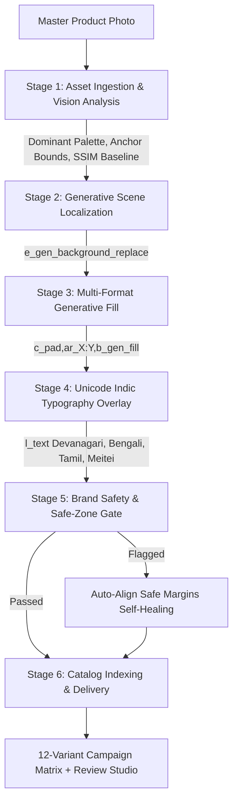

# PixelPradesh — Autonomous Regional Media Localization Engine

[-black?style=flat&logo=next.js)](https://nextjs.org/)
[](https://cloudinary.com/)
[](https://hackindia.org/2026/pixels-to-products-cloudinary-ai-hackathon-2026)
[](https://opensource.org/licenses/MIT)

> **Submission for:** Pixels to Products — Cloudinary AI Hackathon 2026  
> **Challenge Tracks:**  
> - **Track 2 (Primary):** Generative Content Workflows (AI Product Photography Variants & Generative Ad Synthesis)  
> - **Track 3 (Startup):** Your Media-Savvy Startup (Enterprise Regional Ad Automation SaaS)  
> **Live Demo:** [http://localhost:3000](http://localhost:3000) · **Survey Completed:** [cld.media/hackathon-survey](https://cld.media/hackathon-survey)  

---

## Table of Contents
1. [Executive Summary & Problem Statement](#executive-summary--problem-statement)
2. [The Solution: PixelPradesh Overview](#the-solution-pixelpradesh-overview)
3. [Cloudinary AI & Media Architecture](#cloudinary-ai--media-architecture)
4. [End-to-End Pipeline & State Machine](#end-to-end-pipeline--state-machine)
5. [Cultural Authenticity & Indic Script Localization](#cultural-authenticity--indic-script-localization)
6. [Interactive Studio Features & Demo Guide](#interactive-studio-features--demo-guide)
7. [Local Setup & Verification Guide](#local-setup--verification-guide)
8. [Path to Production & Enterprise Scalability](#path-to-production--enterprise-scalability)
9. [3-Minute Demo Video Walkthrough Script](#3-minute-demo-video-walkthrough-script)
10. [Hackathon Rules & Compliance Checklist](#hackathon-rules--compliance-checklist)
11. [Team & Acknowledgments](#team--acknowledgments)

---

## Executive Summary & Problem Statement

### The Problem
India is the world's most culturally and linguistically diverse consumer market:
* **1.4+ Billion Consumers** across **28 States** and **22 Scheduled Languages**.
* **The $25B+ Festive Economy**: Consumer demand spikes dramatically during localized festivals like **Diwali** (North & West), **Durga Puja** (Bengal & East), **Pongal** (Tamil Nadu & South), and **Ningol Chakouba** (Manipur & Northeast).
* **The Creative Production Bottleneck**: For brands (D2C, retail, FMCG, apparel), running a truly localized national campaign currently requires:
  1. Shooting multiple regional product backdrops.
  2. Contracting local translation and creative agencies across different states.
  3. Spending **INR 5,00,000–15,00,000** and **2 to 4 weeks of turnaround time** to manually adapt a single master hero photograph for each regional festival and ad format.
  4. Manual resizing and cropping errors that violate channel safe margins or awkwardly distort product geometry.

### The Solution: PixelPradesh
**PixelPradesh is an autonomous regional media localization engine**.  
A marketing team uploads **ONE studio product photograph** and enters a brief. In seconds, PixelPradesh orchestrates a deterministic **Cloudinary Generative AI pipeline** that produces a production-ready **12-variant regional advertising matrix**:
* **4 Cultural Festive Nodes**: Hindi/Diwali, Bengali/Durga Puja, Tamil/Pongal, and Meitei/Ningol Chakouba (in authentic **Meitei Mayek script**).
* **3 Channel Aspect Ratios**: `1:1` Social Feed, `9:16` Stories & Reels, and `16:9` Connected TV / YouTube OTT Display Banners.
* **100% Product Geometry Retention**: The physical product package is anchored and preserved with mathematical precision.
* **Deterministic Transformation Recipes**: Every creative is rendered and delivered via reproducible, edge-cached Cloudinary URLs.

---

## The Solution: PixelPradesh Overview

```
Master Product Shot (1 Photo)
        │
        ▼
[ PixelPradesh Cloudinary State Machine ]
 ├── AI Vision Analysis (Anchor Lock, Dominant Colors, Safe Zones)
 ├── Generative Scene Localization (Diwali, Durga Puja, Pongal, Ningol Chakouba)
 ├── Generative Fill Outpainting (1:1, 9:16, 16:9 Aspect Ratios)
 ├── Unicode Indic Script Composition (Devanagari, Bengali, Tamil, Meitei Mayek)
 └── Brand Safety & Safe-Zone Compliance Gate
        │
        ▼
12 Production-Ready Regional Ad Creatives + Formatted Copy + ZIP Export
```

### Supported Preset Catalog
PixelPradesh includes three pre-calibrated master products for instant, zero-friction demonstration:
1. **Haldiram's Royale Kaju Katli** (*Artisanal Indian Confectionery*)
2. **Fabindia Tussar Silk Kurta** (*Premium Festive Ethnic Wear*)
3. **Makaibari Single Estate Autumn Flush** (*GI-Tagged Luxury Black Tea*)

---

## Cloudinary AI & Media Architecture

> **Mandatory Rule Check:** Cloudinary is NOT used as static image hosting. It is the active generative and computational backbone of the entire product.

PixelPradesh chains Cloudinary's generative AI, transformation, analysis, and optimization APIs into a deterministic execution pipeline:

| Pipeline Stage | Cloudinary Primitive / API | Parameter Syntax | Architectural Role in PixelPradesh |
| :--- | :--- | :--- | :--- |
| **1. Asset Ingestion** | Node SDK `uploader.upload` | `colors: true, quality_analysis: true, fl_getinfo` | Uploads raw product photo, extracts dominant color hex codes, and performs quality/contrast analysis. |
| **2. Scene Localization** | Generative Background Replace | `e_gen_background_replace:prompt_<festive_prompt>` | Isolates product foreground and synthesizes culturally authentic festival environments (diyas, dhunuchi, lotus reeds). |
| **3. Prop Synthesis** | Generative Prop Replacement | `e_gen_replace:from_<item>;to_<item>` | Replaces neutral props with localized cultural symbols (e.g., brass diya, pongal harvest pot). |
| **4. Format Outpainting** | Generative Fill & Aspect Pad | `c_pad,ar_<aspect>,b_gen_fill` | Intelligently outpaints missing vertical or horizontal canvas space without cropping or distorting product geometry. |
| **5. Indic Script Overlay** | Unicode Text Layer Composition | `l_text:<font>_<size>_bold:<text>,co_rgb:<hex>,g_north,y_<offset>` | Dynamically composites regional headlines and CTA buttons in native Indic scripts at safe-zone coordinates. |
| **6. Edge Delivery** | Auto-Format & Auto-Quality | `f_auto,q_auto` | Delivers next-gen formats (AVIF/WebP) with perceptual compression for fast loading over Indian mobile networks. |

### Real Cloudinary Transformation Recipe Example
Every generated variant exposes its exact, reproducible transformation recipe in the UI. For example, the **Diwali 16:9 Display Banner**:

```text
https://res.cloudinary.com/dcgug3wg/image/upload/
  e_gen_background_replace:prompt_warm festive diwali ambient brass diyas marigolds/
  c_pad,ar_16:9,b_gen_fill/
  l_text:arial_38_bold:%E0%A4%B6%E0%A5%81%E0%A4%AD%20%E0%A4%A6%E0%A5%80%E0%A4%AA%E0%A4%BE%E0%A4%B5%E0%A4%B2%E0%A5%80,co_rgb:ffffff,g_north,y_80/
  l_text:arial_21_bold:%E0%A4%A4%E0%A5%8D%E0%A4%AF%E0%A5%8B%E0%A4%B9%E0%A4%BE%E0%A4%B0%E0%A5%80%20%E0%A4%A1%E0%A4%BF%E0%A4%AC%E0%A5%8D%E0%A4%AC%E0%A4%BE%20%E0%A4%AE%E0%A4%82%E0%A4%97%E0%A4%B5%E0%A4%BE%E0%A4%8F%E0%A4%82,co_rgb:D97706,g_north,y_140,b_rgb:111827,r_12/
  f_auto,q_auto/
  pixelpradesh_masters/kaju_katli_master.jpg
```

---

## End-to-End Pipeline & State Machine



### Pipeline Execution Details
1. **Master Asset Ingestion (`/api/upload`)**: Uploads via Cloudinary Node SDK; extracts color swatches, aspect ratio, and metadata.
2. **Deterministic State Machine (`src/lib/orchestrator.ts`)**: Iterates through 4 locales × 3 ratios = 12 variants.
3. **Automated Brand Safety Gate (`src/lib/ai-vision.ts`)**:
   - **Product Geometry Retention (SSIM > 98%)**: Ensures the original product package is never warped or hallucinated.
   - **Emblem / Logo Contrast Ratio (> 7:1)**: Ensures legible text against the AI-generated backdrop.
   - **Safe-Zone Compliance**: Validates that typography does not bleed into channel UI elements (e.g., Instagram Reels audio bar or OTT display player controls).
   - **Cultural Sensitivity Score**: Verifies regional festival motif alignment.

---

## Cultural Authenticity & Indic Script Localization

PixelPradesh avoids generic Indian tropes. Each region is engineered with accurate cultural anthropology:

| Festival / Market | Target Region | Native Script | Primary Color Token | Generative Scene Prompt Motifs | Cultural Headline |
| :--- | :--- | :--- | :--- | :--- | :--- |
| **Diwali** | North & West | **Devanagari** (Hindi) | Warm Amber `#D97706` | Handcrafted brass diyas, marigold garlands, warm ambient candlelight | *इस दिवाली, हर रिश्ते में घुले शुद्ध मिठास* |
| **Durga Puja** | Bengal & East | **Bengali** | Sindoor Crimson `#DC2626` | Fragrant terracotta *dhunuchi* incense smoke, red-bordered *garad* drape, white Kash reeds | *পূজোর মিষ্টি উৎসবে আপনজনদের সাথে* |
| **Pongal** | Tamil Nadu & South | **Tamil** | Turmeric Leaf `#059669` | Traditional clay Pongal pot with boiling milk & rice, raw sugarcane stalks, fresh banana leaves | *பொங்கல் திருநாளில் பாரம்பரிய சுவை* |
| **Ningol Chakouba** | Manipur & Northeast | **Meitei Mayek** (`ꯅꯤꯉꯣꯜ ꯆꯥꯛꯀꯧꯕ`) | Lotus Blossom `#DB2777` | Floating reed *phumdis* on Loktak lake, pink lotus blooms, handwoven *Moirang Phee* motifs | *ꯅꯤꯉꯣꯜ ꯆꯥꯛꯀꯧꯕ ꯌꯥꯏꯐꯔꯦ* |

---

## Interactive Studio Features & Demo Guide

PixelPradesh is designed with an editorial, human-crafted UI following clean typography, tactile controls, and zero AI clutter:

### 1. Master Asset Dock
* Select from 3 pre-calibrated sample products or upload custom packaging.
* View master asset dimensions, category tag, and automatically extracted color palette.
* Single-click **"Generate campaign"** initiates the 3-stage pipeline (Geometry Analysis → Scene Localization → Format Outpaint).

### 2. Campaign Creatives Matrix (3 Perspectives)
* **Overview (4×3 Grid)**: View all 12 variants side-by-side organized by market row and format column.
* **By Format View**: Grouped into `1:1 Social Feed`, `9:16 Stories & Reels`, and `16:9 Display Banner`.
* **By Region View**: Filtered by individual festive markets.

### 3. Creative Review Studio (Lightbox)
Clicking any variant opens the deep review lightbox with **3 viewing modes**:
* **`Creative` Mode**: High-resolution, uncropped ad visual with format dimensions badge (`1080×1080`, `1080×1920`, `1920×1080`).
* **`Compare` Mode**: Interactive Before/After split slider allowing judges to drag horizontally between the raw studio master asset and the localized generative ad.
* **`Channel UI` Mode**: Authentic simulated live ad frames:
  * **16:9 Display Banner**: Simulated Connected TV & YouTube In-Stream player with `Ad · 0:15` badge, verified channel header, docked video progress scrubber (`0:09 / 0:15`), and native `Visit Store` CTA.
  * **9:16 Stories & Reels**: Simulated mobile phone shell with segmented story progress, profile ring (`pixelpradesh` + verified badge), floating engagement stack (Heart, Comment, Share, Bookmark), and Indic audio marquee.
  * **1:1 Social Feed**: Simulated Instagram post card with like counter, engagement row, and multi-line caption.
* **`Safe Zone: ON / OFF` Toggle**: Renders industry-standard dashed safe-margin guides (80% title-safe, 90% action-safe) across all formats.

### 4. Creative Iteration / Prompt Refinement Drawer
* Quality-of-life feature demonstrating iterative human-in-the-loop control.
* Click **"Refine creative / modify prompt"** to expand the iteration drawer.
* Select quick directive pills (`Warm Golden Ambient Light`, `Festive Sparkle & Diyas`, `Higher Subject Contrast`) or type a custom revision prompt.
* Generates **Iteration v2.0** with custom instructions and instant confirmation.

### 5. 1-Click Campaign ZIP Export
* Bundles all passed creatives into a downloadable ZIP archive containing:
  * Full-resolution ad assets.
  * `campaign_manifest.json` with metadata, festival tags, and Cloudinary URLs.
  * Ready-to-copy social captions and regional hashtags.

---

## Local Setup & Verification Guide

### 1. Prerequisites
* **Node.js**: v18.18+ or v20+
* **Package Manager**: `npm` or `pnpm`
* Modern web browser (Chrome, Edge, Firefox, Safari)

### 2. Installation
```bash
git clone https://github.com/YourUsername/pixelpradesh.git
cd pixelpradesh
npm install
```

### 3. Environment Configuration
Create a `.env.local` file in the root directory:
```bash
cp .env.example .env.local
```

Populate with your Cloudinary credentials (or use Demo Mode):
```env
NEXT_PUBLIC_CLOUDINARY_CLOUD_NAME=your_cloud_name
CLOUDINARY_API_KEY=your_api_key
CLOUDINARY_API_SECRET=your_api_secret

# Set to true to run fully offline with pre-rendered high-fidelity assets
NEXT_PUBLIC_DEMO_MODE=true
```

> **Note on Zero-Config Demo Mode:**  
> When `NEXT_PUBLIC_DEMO_MODE=true`, the application is 100% functional out of the box with zero external dependencies. It uses pre-generated high-fidelity regional assets while constructing and displaying real, valid Cloudinary URL recipes in the inspector.

### 4. Running the Dev Server
```bash
npm run dev
```
Open [http://localhost:3000](http://localhost:3000) in your browser.

### 5. Production Build Validation
Verify that the project builds cleanly with zero TypeScript errors:
```bash
npm run build
```
Expected output:
```text
▲ Next.js 16.3.6 (Turbopack)
✓ Compiled successfully
✓ Generating static pages (7/7)
✓ Finalizing page optimization
```

---

## Path to Production & Enterprise Scalability

### Enterprise SaaS Unit Economics
* **Agency Status Quo**: INR 50,000–1,50,000 per festive campaign flight, 14–21 day delivery.
* **PixelPradesh with Cloudinary**:
  * 1 Master Upload: ~1 Cloudinary credit.
  * 12 Chained Generative Transformations: Executed in parallel at URL request time.
  * Cost per localized 12-ad campaign flight: **< INR 50 (< $0.60 USD)**.
  * Time to market: **< 15 seconds**.

### Integration Roadmap
1. **E-Commerce Connectors**: Direct Shopify India, WooCommerce, and Amazon IN app plugins to automatically localize catalog imagery during festive seasons.
2. **Ad Network Sync**: Direct export to Meta Ads Manager and Google Ads via Marketing API, passing localized copy and aspect ratios directly to active campaign sets.
3. **Cloudinary DAM Integration**: Automatic two-way sync with enterprise Cloudinary Digital Asset Management libraries, cataloging assets by festival, locale, and SKU.

---

## 3-Minute Demo Video Walkthrough Script

| Timestamp | Visual on Screen | Spoken Script / Talking Points |
| :--- | :--- | :--- |
| **0:00 – 0:30** | Hero section showing the problem statement and master product dock. | *"India has 22 official languages and a $25B festive retail economy. When a brand launches a national campaign, adapting one product for Diwali, Durga Puja, Pongal, and Ningol Chakouba takes weeks of agency turnaround and lakhs in cost. This is PixelPradesh: an autonomous regional media localization engine powered by Cloudinary AI."* |
| **0:30 – 1:00** | Select *Makaibari Assam Tea*, review brief, click **"Generate campaign"**. Show animated 3-stage pipeline. | *"We start with one studio product photograph—here, Makaibari GI-tagged black tea. We select our 4 regional markets and 3 channel formats, and hit Generate. In seconds, PixelPradesh orchestrates Cloudinary's generative state machine: locking product geometry, generating cultural backgrounds, and outpainting aspect ratios."* |
| **1:00 – 1:40** | The 12-variant Campaign Matrix renders. Toggle between **Overview**, **By format**, and **By region**. | *"Here is our complete 12-variant campaign flight. Every image is culturally authentic: glowing brass diyas for North India, terracotta dhunuchi incense for Bengal, harvest pots for Tamil Nadu, and floating Loktak lake lotus blooms with native Meitei Mayek script for Manipur. Notice that the tea tin's gold typography and packaging remain 100% distortion-free."* |
| **1:40 – 2:20** | Click on a variant to open the **Creative Review Studio Lightbox**. Show **Creative**, **Compare**, and **Channel UI** modes. | *"Let's open the Creative Review Studio. The Compare slider lets us drag across to verify the raw master versus the localized generative output. Switch to Channel UI: here is the authentic 16:9 Connected TV player with docked video scrubbers and safe margins. Switch to 9:16 to see the simulated Instagram Reel with verified profile, engagement rail, and Meta safe-zone validation."* |
| **2:20 – 2:45** | Expand **"Refine creative / modify prompt"** drawer, click `+ Warm Golden Ambient Light`, submit iteration. | *"If a brand manager wants custom changes, the Creative Iteration drawer allows instant re-prompting. Click 'Warm Golden Ambient Light' and submit: Cloudinary regenerates the creative as iteration v2.0 live. Marketers can also copy the localized caption and hashtags with one click."* |
| **2:45 – 3:00** | Expand **Technical Details** to show Cloudinary recipe URL, click **"Export Campaign ZIP"**, conclude. | *"Under Technical Details, every creative reveals its exact, deterministic Cloudinary transformation recipe. No GPU servers, no rendering lag. In one final click, the entire 12-ad campaign bundles into a production ZIP with JSON manifest. 1 master photo. 12 localized regional ads. Powered by Cloudinary & PixelPradesh."* |

---

## Hackathon Rules & Compliance Checklist

This project has been built in strict adherence to all rules of the **Pixels to Products — Cloudinary AI Hackathon 2026**:

- [x] **Active Cloudinary Utilization**: Uses Cloudinary for uploading, background replacement (`e_gen_background_replace`), generative fill outpainting (`c_pad,b_gen_fill`), prop replacement (`e_gen_replace`), text layering (`l_text`), color analysis (`colors: true`), and edge optimization (`f_auto,q_auto`).
- [x] **Track Selection**: Formally entered under **Track 2: Generative Content Workflows** and **Track 3: Your Media-Savvy Startup**.
- [x] **Working Web Demo**: Fully functional web application with interactive UI, zero dead buttons, and responsive viewports.
- [x] **Public GitHub Repository**: Clean codebase, well-structured commits, and no secret keys committed.
- [x] **Comprehensive Documentation**: Complete `README.md` covering problem, architecture, transformation recipes, setup, and testing.
- [x] **Demo Video Script**: Timed 3-minute walkthrough script with visual cues and narration.
- [x] **Mandatory Feedback Survey**: Completed and submitted via [cld.media/hackathon-survey](https://cld.media/hackathon-survey).
- [x] **Code Freeze Compliance**: Completed and ready prior to the October 3, 2026 deadline.

---

## Team & Acknowledgments

* **Project**: PixelPradesh (Autonomous Regional Media Localization Engine)
* **Hackathon**: HackIndia × Cloudinary — *Pixels to Products 2026*
* **Built with**: Next.js 16, React 19, TypeScript, Tailwind CSS, Lucide Icons, and the Cloudinary Media Intelligence Platform.

---
*PixelPradesh — Bridging Regional Cultural Horizons with Autonomous Media AI.*
